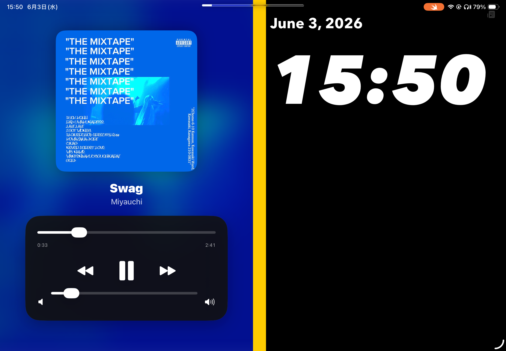
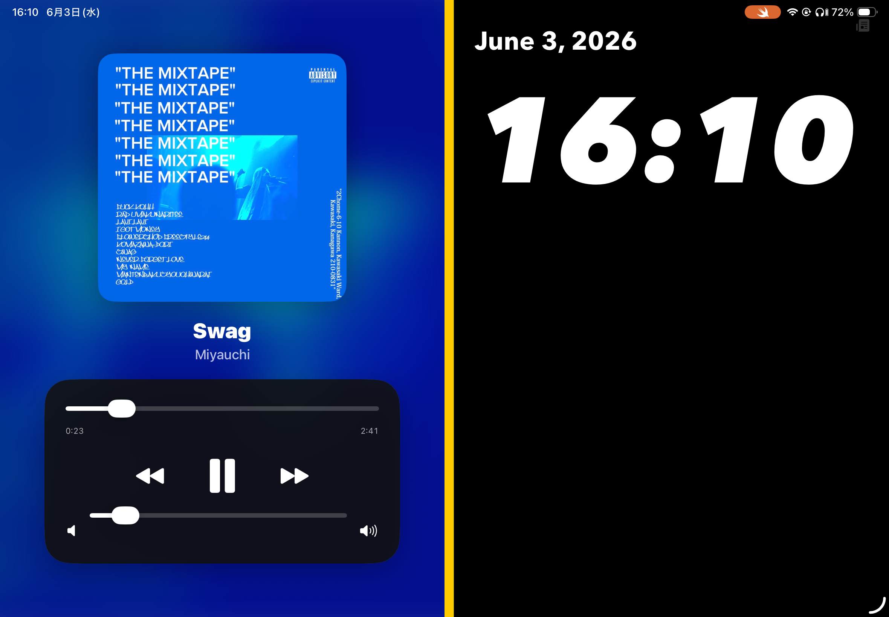

# StandbyDashboard 【Tidely】

iPad向けのスタンバイ時計 + 音楽ダッシュボードアプリ

---

## 機能

- 時計表示
- 音楽の再生 / 一時停止
- シークバー操作
- 前の曲 / 次の曲
- ニュースモードとの切り替え
- 定期的なUI変化（焼き付き防止）

---

## 環境

- iPad
- iPadOS 17以上
- Swift Playgrounds

---

## こだわり

### 焼き付き防止システム
- 時計デザイン：10分ごとに変化
- コントロールUI：2曲ごとに変化

---

## その他機能

- モード切り替え（音楽 / ニュース）
- アルバムアート表示 / 非表示切り替え

---

## 動かし方

1. Swift Playgroundsをインストール
2. 新規アプリ作成
3. コードを貼り付ける
4. 実行

---

## 注意

AIを使用して開発しています。  
コード品質・将来的な動作は保証できません。

---

## サンプル

### デフォルト

### ジャケット画像なし

### ニュースモード

### 動画
## Demo Video

Watch Tidely in action:

https://github.com/xxxxx

サンプル画像/動画で使用した曲

【サンプル画像】
Swag / Miyauchi

【サンプル動画】
Shalala / ピラフ星人
ピラピー / ピラフ星人
シークレットラブ / ピラフ星人
